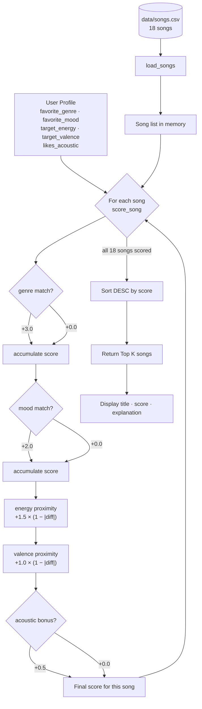

# 🎵 Music Recommender Simulation

## Project Summary

In this project you will build and explain a small music recommender system.

Your goal is to:

- Represent songs and a user "taste profile" as data
- Design a scoring rule that turns that data into recommendations
- Evaluate what your system gets right and wrong
- Reflect on how this mirrors real world AI recommenders

This version builds a **content-based recommender** that scores each song in an 18-song catalog against a user's taste profile (preferred genre, mood, target energy level, and acoustic preference). Songs are ranked by their total score and the top K results are returned with a plain-language explanation of why each one was chosen.

---

## How The System Works

### How real-world recommenders work

Large streaming platforms like Spotify and YouTube Music use two main techniques. **Collaborative filtering** looks at the collective behavior of millions of users — plays, skips, saves, playlist adds — and finds people who share your taste, then recommends what they liked next. It needs no knowledge of what's inside the song; it just follows the crowd signal. **Content-based filtering** does the opposite: it analyzes the song's own attributes (genre, tempo, mood, energy) and finds songs that are similar to what you already enjoy. Real platforms combine both — collaborative filtering is powerful for discovery but requires lots of user data, while content-based filtering works from day one and can explain its own logic.

This simulation uses **pure content-based filtering**, which is transparent and teachable. Every recommendation can be explained with a concrete reason tied to the song's attributes and the user's stated preferences.

---

### Song features

Each `Song` object stores the following attributes from `data/songs.csv`:

| Feature        | Type      | What it captures                                                                            |
| -------------- | --------- | ------------------------------------------------------------------------------------------- |
| `genre`              | string    | Musical category (pop, lofi, rock, ambient, jazz, synthwave, hip-hop, r&b, metal, folk, edm, blues, reggae, classical, indie pop) |
| `mood`               | string    | Emotional context (happy, chill, intense, relaxed, focused, moody, energetic, romantic, peaceful, angry, nostalgic, euphoric, melancholic) |
| `energy`             | float 0–1 | Intensity level; 0.22 (classical) to 0.97 (metal)                                          |
| `valence`            | float 0–1 | Emotional brightness/positivity                                                             |
| `danceability`       | float 0–1 | Rhythmic drive and groove                                                                   |
| `acousticness`       | float 0–1 | Organic vs electronic sound texture                                                         |
| `tempo_bpm`          | float     | Beats per minute                                                                            |
| `popularity`         | int 0–100 | Stream-count proxy; 27 (niche blues) to 85 (pop hit)                                       |
| `release_decade`     | int       | Decade of release: 2000, 2010, or 2020                                                     |
| `speechiness`        | float 0–1 | Fraction of the track that is spoken word or rap                                            |
| `instrumentalness`   | float 0–1 | Fraction that is pure music with no vocals                                                  |
| `liveness`           | float 0–1 | Likelihood the recording captures a live performance                                        |

The catalog was expanded from 10 to **18 songs** to cover genres absent from the starter file: hip-hop, r&b, classical, metal, folk, edm, blues, and reggae. The four most effective features for matching "vibe" are **genre**, **mood**, **energy**, and **valence** — genre and mood act as strong categorical gates while energy and valence provide fine-grained numerical tuning within a genre. The five additional features (`popularity` through `liveness`) are opt-in and only score when the user profile specifies a target for them.

---

### UserProfile features

A `UserProfile` stores:

**Core fields (required):**
- `favorite_genre` — the genre the user most wants to hear
- `favorite_mood` — the emotional context they are in right now
- `target_energy` — a float 0–1 for desired intensity
- `target_valence` — a float 0–1 for desired emotional brightness
- `likes_acoustic` — boolean preference for organic vs electronic sound

**Optional fields (scored only when set):**
- `target_popularity` — int 0–100; rewards songs closest to this niche vs mainstream level
- `preferred_decade` — 2000, 2010, or 2020; rewards songs from that era
- `target_speechiness` — float 0–1; rewards songs matching vocal/rap density preference
- `target_instrumentalness` — float 0–1; rewards songs matching vocal-free preference
- `likes_live` — boolean; adds a bonus for recordings with high liveness

**Sample profile — "Late-night study session":**

```python
user_prefs = {
    "favorite_genre":  "lofi",
    "favorite_mood":   "focused",
    "target_energy":   0.40,
    "target_valence":  0.58,
    "likes_acoustic":  True,
}
```

This profile can clearly differentiate "intense rock" from "chill lofi" because all three dimensions push in opposite directions simultaneously: genre (`lofi` vs `rock`), mood (`focused` vs `intense`), and energy (0.40 vs 0.91). The profile is not too narrow — genre and mood provide categorical gates while energy and valence give continuous gradation, so even songs outside the `lofi` genre receive meaningful partial scores based on how close their feel is to the user's numerical targets.

---

### Scoring Rule (one song)

Each song is evaluated with a weighted sum:

```
# --- Base scoring (always active) ---
score = 0
if song.genre == user.favorite_genre:   score += 3.0   # strongest signal
if song.mood  == user.favorite_mood:    score += 2.0   # emotional context
score += 1.5 × (1 − |user.target_energy  − song.energy|)
score += 1.0 × (1 − |user.target_valence − song.valence|)
if user.likes_acoustic and song.acousticness > 0.6:  score += 0.5

# --- Advanced scoring (fires only when profile includes the optional field) ---
if user.target_popularity:       score += 0.50 × (1 − |target − song.popularity| / 100)
if user.preferred_decade:        score += 1.00 × (1 − |target − song.release_decade| / 60)
if user.target_speechiness:      score += 0.50 × (1 − |target − song.speechiness|)
if user.target_instrumentalness: score += 0.75 × (1 − |target − song.instrumentalness|)
if user.likes_live and song.liveness > 0.2:  score += 0.30
```

Genre carries the highest weight (3.0) because it is the single most defining dimension of musical taste. Mood is second (2.0) because it captures use-case context that genre alone misses. Numerical features use a **proximity formula** — `1 − |difference|` — so a perfect match earns the full weight and a far match earns near zero.

**Scoring strategies:** Four weight presets (`DEFAULT`, `GENRE_FIRST`, `MOOD_FIRST`, `ENERGY_FOCUSED`) swap which features drive rankings without changing any other code. Pass a preset to `recommend_songs(weights=MOOD_FIRST)` to change strategy.

**Diversity filter:** After scoring, an optional post-processing step caps results at 1 song per artist and 2 songs per genre. Pass `diverse=True` to `recommend_songs` to enable it.

---

### Ranking Rule (choosing what to recommend)

After every song in the catalog is scored, they are sorted from highest to lowest score. The top K songs are returned. Separating scoring from ranking keeps the logic clean: you can adjust weights or add features to the scoring function without touching the sort, and you can change K (return 3 vs 10 results) without rewriting any score math.

```
ranked = sorted(all_songs, key=lambda s: score_song(user, s), reverse=True)
return ranked[:k]
```

---

### Data Flow



---

### Known Biases and Limitations

| Bias | Why it happens | Impact |
|---|---|---|
| Genre dominance | Genre weight (3.0) can outweigh a perfect mood + energy match from another genre | A mediocre lofi song may rank above a near-perfect ambient song for a lofi user |
| No partial genre credit | `lofi` vs `ambient` scores 0.0 despite similar vibes; there is no concept of genre proximity | Related genres are treated as completely different |
| Catalog skew | Each genre has only 1–2 songs, so a user who prefers hip-hop has very limited choices | Top results will be thin for underrepresented genres |
| Cold start | Profiles require explicit values; the system never learns from actual listening behavior | A user's first-run profile may not reflect their real taste |
| Acoustic bonus asymmetry | The acoustic bonus only fires when the user prefers acoustic; non-acoustic users get no equivalent bonus | Slight structural advantage for acoustic-preferring profiles |

## Getting Started

### Setup

1. Create a virtual environment (optional but recommended):

   ```bash
   python -m venv .venv
   source .venv/bin/activate      # Mac or Linux
   .venv\Scripts\activate         # Windows

   ```

2. Install dependencies

```bash
pip install -r requirements.txt
```

3. Run the app:

```bash
python -m src.main
```

### Running Tests

Run the starter tests with:

```bash
pytest
```

You can add more tests in `tests/test_recommender.py`.

---

## CLI Output (Phase 3 Verification)

Terminal output from `python -m src.main` with two starter profiles:

```
Loaded 18 songs.

============================================================
Profile: Pop / Happy (high energy)
  genre=pop  mood=happy  energy=0.8  valence=0.84  acoustic=False
------------------------------------------------------------
  1. Sunrise City  —  Neon Echo
     Score : 7.47
     Why   : genre match: pop (+3.0) | mood match: happy (+2.0) | energy proximity (+1.47) | valence proximity (+1.00)

  2. Gym Hero  —  Max Pulse
     Score : 5.23
     Why   : genre match: pop (+3.0) | energy proximity (+1.30) | valence proximity (+0.93)

  3. Rooftop Lights  —  Indigo Parade
     Score : 4.41
     Why   : mood match: happy (+2.0) | energy proximity (+1.44) | valence proximity (+0.97)

  4. Crown Heights Flow  —  The Fresh Cipher
     Score : 2.36
     Why   : energy proximity (+1.47) | valence proximity (+0.89)

  5. Drop Zone  —  Voltage Drop
     Score : 2.27
     Why   : energy proximity (+1.28) | valence proximity (+0.99)

============================================================
Profile: Late-night study session (lofi / focused)
  genre=lofi  mood=focused  energy=0.4  valence=0.58  acoustic=True
------------------------------------------------------------
  1. Focus Flow  —  LoRoom
     Score : 7.99
     Why   : genre match: lofi (+3.0) | mood match: focused (+2.0) | energy proximity (+1.50) | valence proximity (+0.99) | acoustic match (+0.50)

  2. Midnight Coding  —  LoRoom
     Score : 5.95
     Why   : genre match: lofi (+3.0) | energy proximity (+1.47) | valence proximity (+0.98) | acoustic match (+0.50)

  3. Library Rain  —  Paper Lanterns
     Score : 5.90
     Why   : genre match: lofi (+3.0) | energy proximity (+1.42) | valence proximity (+0.98) | acoustic match (+0.50)

  4. Coffee Shop Stories  —  Slow Stereo
     Score : 2.83
     Why   : energy proximity (+1.46) | valence proximity (+0.87) | acoustic match (+0.50)

  5. Porch Song  —  Blue Ridge Duo
     Score : 2.82
     Why   : energy proximity (+1.36) | valence proximity (+0.96) | acoustic match (+0.50)
============================================================
```

The results are intuitive: "Sunrise City" is a clean genre + mood + energy triple-match for the pop profile. "Focus Flow" scores 7.99 for the study profile because all five scoring rules fire simultaneously (genre, mood, energy, valence, and acoustic bonus).

---

## Phase 4 Evaluation — All Profiles and Experiments

Full terminal output from `python -m src.main` (Phase 4 run, 6 profiles + weight-shift experiment):

```
Loaded 18 songs.

================================================================
Profile: Pop / Happy (high energy)
  genre=pop  mood=happy  energy=0.8  valence=0.84  acoustic=False
----------------------------------------------------------------
  1. Sunrise City  —  Neon Echo          Score: 7.47
     Why: genre match: pop (+3.0) | mood match: happy (+2.0) | energy proximity (+1.47) | valence proximity (+1.00)
  2. Gym Hero  —  Max Pulse              Score: 5.23
     Why: genre match: pop (+3.0) | energy proximity (+1.30) | valence proximity (+0.93)
  3. Rooftop Lights  —  Indigo Parade    Score: 4.41
     Why: mood match: happy (+2.0) | energy proximity (+1.44) | valence proximity (+0.97)
  4. Crown Heights Flow  —  The Fresh Cipher   Score: 2.36
  5. Drop Zone  —  Voltage Drop          Score: 2.27

================================================================
Profile: Late-night study session (lofi / focused)
  genre=lofi  mood=focused  energy=0.4  valence=0.58  acoustic=True
----------------------------------------------------------------
  1. Focus Flow  —  LoRoom              Score: 7.99
     Why: genre match: lofi (+3.0) | mood match: focused (+2.0) | energy proximity (+1.50) | valence proximity (+0.99) | acoustic match (+0.50)
  2. Midnight Coding  —  LoRoom         Score: 5.95
  3. Library Rain  —  Paper Lanterns    Score: 5.90
  4. Coffee Shop Stories  —  Slow Stereo  Score: 2.83
  5. Porch Song  —  Blue Ridge Duo      Score: 2.82

================================================================
Profile: Deep Intense Rock
  genre=rock  mood=intense  energy=0.9  valence=0.45  acoustic=False
----------------------------------------------------------------
  1. Storm Runner  —  Voltline          Score: 7.45
     Why: genre match: rock (+3.0) | mood match: intense (+2.0) | energy proximity (+1.48) | valence proximity (+0.97)
  2. Gym Hero  —  Max Pulse             Score: 4.14   (mood=intense, energy close)
  3. Night Drive Loop  —  Neon Echo     Score: 2.23
  4. Iron Circuit  —  Shatter Grid      Score: 2.17
  5. Crown Heights Flow  —  The Fresh Cipher  Score: 2.04

================================================================
Profile: EDM / Euphoric workout
  genre=edm  mood=euphoric  energy=0.95  valence=0.85  acoustic=False
----------------------------------------------------------------
  1. Drop Zone  —  Voltage Drop         Score: 7.50
     Why: genre match: edm (+3.0) | mood match: euphoric (+2.0) | energy proximity (+1.50) | valence proximity (+1.00)
  2. Gym Hero  —  Max Pulse             Score: 2.39
  3. Sunrise City  —  Neon Echo         Score: 2.29
  4. Rooftop Lights  —  Indigo Parade   Score: 2.18
  5. Crown Heights Flow  —  The Fresh Cipher  Score: 2.13

================================================================
Profile: ADVERSARIAL — High-energy + melancholic (conflicting)
  genre=blues  mood=melancholic  energy=0.95  valence=0.25  acoustic=False
----------------------------------------------------------------
  1. Bayou Blues  —  Crescent Cane      Score: 6.65
     Why: genre match: blues (+3.0) | mood match: melancholic (+2.0) | energy proximity (+0.73) | valence proximity (+0.92)
     ** NOTE: energy 0.44 vs target 0.95 — a 0.51 gap — but genre+mood (5.0 pts) overwhelms it **
  2. Iron Circuit  —  Shatter Grid      Score: 2.44   (high energy + low valence)
  3. Storm Runner  —  Voltline          Score: 2.21

================================================================
Profile: ADVERSARIAL — Ghost genre (country not in catalog)
  genre=country  mood=relaxed  energy=0.5  valence=0.7  acoustic=True
----------------------------------------------------------------
  ** No genre bonus fires for ANY song — zero genre matches **
  1. Coffee Shop Stories  —  Slow Stereo  Score: 4.79
     Why: mood match: relaxed (+2.0) | energy proximity (+1.30) | valence proximity (+0.99) | acoustic match (+0.50)
  2. Island Breeze  —  Coral Current    Score: 4.34
  3. Midnight Coding  —  LoRoom         Score: 2.74

================================================================
EXPERIMENT: Weight shift — genre 3.0→1.5, energy 1.5→3.0 (Pop/Happy profile)
----------------------------------------------------------------
  ORIGINAL  →  1. Sunrise City (7.47)  2. Gym Hero (5.23)      3. Rooftop Lights (4.41)
  SHIFTED   →  1. Sunrise City (7.44)  2. Rooftop Lights (5.85) 3. Gym Hero (5.04)

  Rooftop Lights jumps from #3 to #2 because it has a near-perfect energy match
  (0.76 vs target 0.80, diff=0.04) AND the mood match. Gym Hero drops because
  its energy (0.93) is further from target despite being the correct genre.
================================================================
```

**What the results show:** The system works intuitively for clean profiles (rock fan gets rock, EDM fan gets EDM). The adversarial tests reveal that genre+mood weight (5.0 combined) can dominate the score even when numerical features are a poor match. The weight-shift experiment confirms the system is sensitive to these ratios.

---

## Experiments You Tried

### Weight-shift experiment (Phase 4)

Halved genre weight (3.0 → 1.5) and doubled energy weight (1.5 → 3.0) for the Pop/Happy profile.

- Original ranking: Sunrise City → Gym Hero → Rooftop Lights
- Shifted ranking: Sunrise City → **Rooftop Lights** → **Gym Hero**

Rooftop Lights jumps because it has a tighter energy match (diff 0.04) and the mood bonus. Gym Hero drops because its energy (0.93) is further from the 0.80 target. When you make energy matter more, the system becomes less genre-loyal and more feel-precise.

### Ghost genre test

A user asking for "country" (not in catalog) gets zero genre bonuses. The system falls back to mood and numerical proximity — Coffee Shop Stories (jazz, relaxed) ranks first. The recommendation is defensible but the user asked for country and got jazz. The system gives no indication it couldn't satisfy the genre request.

---

## Limitations and Risks

- **Genre dominance**: +3.0 for a categorical match can override a 0.51 energy mismatch (blues adversarial test)
- **No partial genre credit**: lofi and ambient are treated as equally different, same as lofi vs metal
- **Ghost genre problem**: missing genres produce no warning — silent substitution
- **Catalog skew**: most genres have 1–2 songs; the lofi user's top-3 is entirely predictable
- **Cold start**: no learning from behavior — preferences must be stated explicitly every time

See [model_card.md](model_card.md) for a deeper analysis of each bias.

---

## Reflection

See the full analysis in [model_card.md](model_card.md).

Building this system made clear that **recommenders do not understand music — they understand numbers**. The scoring formula has no concept that lofi and ambient share a similar vibe; it just sees that their genre strings do not match and assigns zero. Every recommendation can be explained with arithmetic, which is both the strength and the limit of the approach.

The most surprising result was how much the *weight ratios* matter. Changing genre from 3.0 to 1.5 and energy from 1.5 to 3.0 was a small numerical tweak, but it meaningfully reshuffled the rankings — Rooftop Lights climbed past Gym Hero because it had a tighter energy fit that the original genre-heavy weights had been hiding. That single experiment showed that the weights encode a value judgment about what music taste *is*, not just a technical dial. Real platforms face the same tradeoff at massive scale, and the choice of what to weight shapes what artists get promoted and what users never discover.
