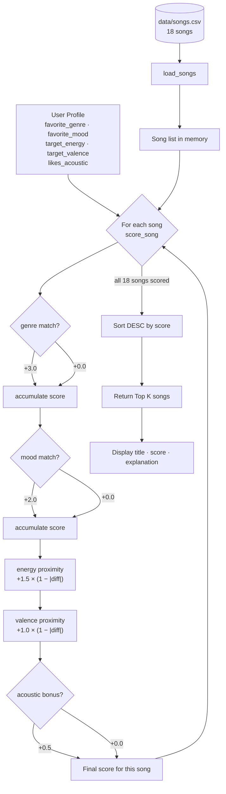

# 🎵 Music Recommender Simulation

## Project Summary

In this project you will build and explain a small music recommender system.

Your goal is to:

- Represent songs and a user "taste profile" as data
- Design a scoring rule that turns that data into recommendations
- Evaluate what your system gets right and wrong
- Reflect on how this mirrors real world AI recommenders

This version builds a **content-based recommender** that scores each song in an 18-song catalog against a user's taste profile (preferred genre, mood, target energy level, and acoustic preference). Songs are ranked by their total score and the top K results are returned with a plain-language explanation of why each one was chosen.

---

## How The System Works

### How real-world recommenders work

Large streaming platforms like Spotify and YouTube Music use two main techniques. **Collaborative filtering** looks at the collective behavior of millions of users — plays, skips, saves, playlist adds — and finds people who share your taste, then recommends what they liked next. It needs no knowledge of what's inside the song; it just follows the crowd signal. **Content-based filtering** does the opposite: it analyzes the song's own attributes (genre, tempo, mood, energy) and finds songs that are similar to what you already enjoy. Real platforms combine both — collaborative filtering is powerful for discovery but requires lots of user data, while content-based filtering works from day one and can explain its own logic.

This simulation uses **pure content-based filtering**, which is transparent and teachable. Every recommendation can be explained with a concrete reason tied to the song's attributes and the user's stated preferences.

---

### Song features

Each `Song` object stores the following attributes from `data/songs.csv`:

| Feature        | Type      | What it captures                                                                            |
| -------------- | --------- | ------------------------------------------------------------------------------------------- |
| `genre`        | string    | Musical category (pop, lofi, rock, ambient, jazz, synthwave, hip-hop, r&b, metal, folk, edm, blues, reggae, classical, indie pop) |
| `mood`         | string    | Emotional context (happy, chill, intense, relaxed, focused, moody, energetic, romantic, peaceful, angry, nostalgic, euphoric, melancholic) |
| `energy`       | float 0–1 | Intensity level; 0.22 (classical) to 0.97 (metal)                                          |
| `valence`      | float 0–1 | Emotional brightness/positivity                                                             |
| `danceability` | float 0–1 | Rhythmic drive and groove                                                                   |
| `acousticness` | float 0–1 | Organic vs electronic sound texture                                                         |
| `tempo_bpm`    | float     | Beats per minute                                                                            |

The catalog was expanded from 10 to **18 songs** to include genres and moods missing from the starter file: hip-hop, r&b, classical, metal, folk, edm, blues, and reggae. The four most effective features for matching "vibe" are **genre**, **mood**, **energy**, and **valence** — genre and mood act as strong categorical gates while energy and valence provide fine-grained numerical tuning within a genre.

---

### UserProfile features

A `UserProfile` stores:

- `favorite_genre` — the genre the user most wants to hear
- `favorite_mood` — the emotional context they are in right now
- `target_energy` — a float 0–1 representing how high-energy they want the music
- `target_valence` — a float 0–1 representing how bright/positive the user wants the music to feel
- `likes_acoustic` — boolean preference for organic vs electronic sound

**Sample profile — "Late-night study session":**

```python
user_prefs = {
    "favorite_genre":  "lofi",
    "favorite_mood":   "focused",
    "target_energy":   0.40,
    "target_valence":  0.58,
    "likes_acoustic":  True,
}
```

This profile can clearly differentiate "intense rock" from "chill lofi" because all three dimensions push in opposite directions simultaneously: genre (`lofi` vs `rock`), mood (`focused` vs `intense`), and energy (0.40 vs 0.91). The profile is not too narrow — genre and mood provide categorical gates while energy and valence give continuous gradation, so even songs outside the `lofi` genre receive meaningful partial scores based on how close their feel is to the user's numerical targets.

---

### Scoring Rule (one song)

Each song is evaluated with a weighted sum:

```
score = 0
if song.genre == user.favorite_genre:   score += 3.0   # strongest signal
if song.mood  == user.favorite_mood:    score += 2.0   # emotional context
score += 1.5 × (1 − |user.target_energy − song.energy|)   # proximity, not just "higher"
score += 1.0 × (1 − |user.target_valence − song.valence|) # emotional brightness match
if user.likes_acoustic and song.acousticness > 0.6:        score += 0.5
```

Genre carries the highest weight (3.0) because it is the single most defining dimension of musical taste. Mood is second (2.0) because it captures use-case context that genre alone misses (two pop songs can feel completely different if one is intense and one is chill). The numerical features use a **proximity formula** — `1 − |difference|` — so a song that exactly matches the user's target energy scores the full 1.5 points, and songs further away score less.

---

### Ranking Rule (choosing what to recommend)

After every song in the catalog is scored, they are sorted from highest to lowest score. The top K songs are returned. Separating scoring from ranking keeps the logic clean: you can adjust weights or add features to the scoring function without touching the sort, and you can change K (return 3 vs 10 results) without rewriting any score math.

```
ranked = sorted(all_songs, key=lambda s: score_song(user, s), reverse=True)
return ranked[:k]
```

---

### Data Flow



---

### Known Biases and Limitations

| Bias | Why it happens | Impact |
|---|---|---|
| Genre dominance | Genre weight (3.0) can outweigh a perfect mood + energy match from another genre | A mediocre lofi song may rank above a near-perfect ambient song for a lofi user |
| No partial genre credit | `lofi` vs `ambient` scores 0.0 despite similar vibes; there is no concept of genre proximity | Related genres are treated as completely different |
| Catalog skew | Each genre has only 1–2 songs, so a user who prefers hip-hop has very limited choices | Top results will be thin for underrepresented genres |
| Cold start | Profiles require explicit values; the system never learns from actual listening behavior | A user's first-run profile may not reflect their real taste |
| Acoustic bonus asymmetry | The acoustic bonus only fires when the user prefers acoustic; non-acoustic users get no equivalent bonus | Slight structural advantage for acoustic-preferring profiles |

## Getting Started

### Setup

1. Create a virtual environment (optional but recommended):

   ```bash
   python -m venv .venv
   source .venv/bin/activate      # Mac or Linux
   .venv\Scripts\activate         # Windows

   ```

2. Install dependencies

```bash
pip install -r requirements.txt
```

3. Run the app:

```bash
python -m src.main
```

### Running Tests

Run the starter tests with:

```bash
pytest
```

You can add more tests in `tests/test_recommender.py`.

---

## CLI Output (Phase 3 Verification)

Terminal output from `python -m src.main` with two starter profiles:

```
Loaded 18 songs.

============================================================
Profile: Pop / Happy (high energy)
  genre=pop  mood=happy  energy=0.8  valence=0.84  acoustic=False
------------------------------------------------------------
  1. Sunrise City  —  Neon Echo
     Score : 7.47
     Why   : genre match: pop (+3.0) | mood match: happy (+2.0) | energy proximity (+1.47) | valence proximity (+1.00)

  2. Gym Hero  —  Max Pulse
     Score : 5.23
     Why   : genre match: pop (+3.0) | energy proximity (+1.30) | valence proximity (+0.93)

  3. Rooftop Lights  —  Indigo Parade
     Score : 4.41
     Why   : mood match: happy (+2.0) | energy proximity (+1.44) | valence proximity (+0.97)

  4. Crown Heights Flow  —  The Fresh Cipher
     Score : 2.36
     Why   : energy proximity (+1.47) | valence proximity (+0.89)

  5. Drop Zone  —  Voltage Drop
     Score : 2.27
     Why   : energy proximity (+1.28) | valence proximity (+0.99)

============================================================
Profile: Late-night study session (lofi / focused)
  genre=lofi  mood=focused  energy=0.4  valence=0.58  acoustic=True
------------------------------------------------------------
  1. Focus Flow  —  LoRoom
     Score : 7.99
     Why   : genre match: lofi (+3.0) | mood match: focused (+2.0) | energy proximity (+1.50) | valence proximity (+0.99) | acoustic match (+0.50)

  2. Midnight Coding  —  LoRoom
     Score : 5.95
     Why   : genre match: lofi (+3.0) | energy proximity (+1.47) | valence proximity (+0.98) | acoustic match (+0.50)

  3. Library Rain  —  Paper Lanterns
     Score : 5.90
     Why   : genre match: lofi (+3.0) | energy proximity (+1.42) | valence proximity (+0.98) | acoustic match (+0.50)

  4. Coffee Shop Stories  —  Slow Stereo
     Score : 2.83
     Why   : energy proximity (+1.46) | valence proximity (+0.87) | acoustic match (+0.50)

  5. Porch Song  —  Blue Ridge Duo
     Score : 2.82
     Why   : energy proximity (+1.36) | valence proximity (+0.96) | acoustic match (+0.50)
============================================================
```

The results are intuitive: "Sunrise City" is a clean genre + mood + energy triple-match for the pop profile. "Focus Flow" scores 7.99 for the study profile because all five scoring rules fire simultaneously (genre, mood, energy, valence, and acoustic bonus).

---

## Experiments You Tried

Use this section to document the experiments you ran. For example:

- What happened when you changed the weight on genre from 2.0 to 0.5
- What happened when you added tempo or valence to the score
- How did your system behave for different types of users

---

## Limitations and Risks

Summarize some limitations of your recommender.

Examples:

- It only works on a tiny catalog
- It does not understand lyrics or language
- It might over favor one genre or mood

You will go deeper on this in your model card.

---

## Reflection

Read and complete `model_card.md`:

[**Model Card**](model_card.md)

Write 1 to 2 paragraphs here about what you learned:

- about how recommenders turn data into predictions
- about where bias or unfairness could show up in systems like this

---

## 7. `model_card_template.md`

Combines reflection and model card framing from the Module 3 guidance. :contentReference[oaicite:2]{index=2}

```markdown
# 🎧 Model Card - Music Recommender Simulation

## 1. Model Name

Give your recommender a name, for example:

> VibeFinder 1.0

---

## 2. Intended Use

- What is this system trying to do
- Who is it for

Example:

> This model suggests 3 to 5 songs from a small catalog based on a user's preferred genre, mood, and energy level. It is for classroom exploration only, not for real users.

---

## 3. How It Works (Short Explanation)

Describe your scoring logic in plain language.

- What features of each song does it consider
- What information about the user does it use
- How does it turn those into a number

Try to avoid code in this section, treat it like an explanation to a non programmer.

---

## 4. Data

Describe your dataset.

- How many songs are in `data/songs.csv`
- Did you add or remove any songs
- What kinds of genres or moods are represented
- Whose taste does this data mostly reflect

---

## 5. Strengths

Where does your recommender work well

You can think about:

- Situations where the top results "felt right"
- Particular user profiles it served well
- Simplicity or transparency benefits

---

## 6. Limitations and Bias

Where does your recommender struggle

Some prompts:

- Does it ignore some genres or moods
- Does it treat all users as if they have the same taste shape
- Is it biased toward high energy or one genre by default
- How could this be unfair if used in a real product

---

## 7. Evaluation

How did you check your system

Examples:

- You tried multiple user profiles and wrote down whether the results matched your expectations
- You compared your simulation to what a real app like Spotify or YouTube tends to recommend
- You wrote tests for your scoring logic

You do not need a numeric metric, but if you used one, explain what it measures.

---

## 8. Future Work

If you had more time, how would you improve this recommender

Examples:

- Add support for multiple users and "group vibe" recommendations
- Balance diversity of songs instead of always picking the closest match
- Use more features, like tempo ranges or lyric themes

---

## 9. Personal Reflection

A few sentences about what you learned:

- What surprised you about how your system behaved
- How did building this change how you think about real music recommenders
- Where do you think human judgment still matters, even if the model seems "smart"
```
